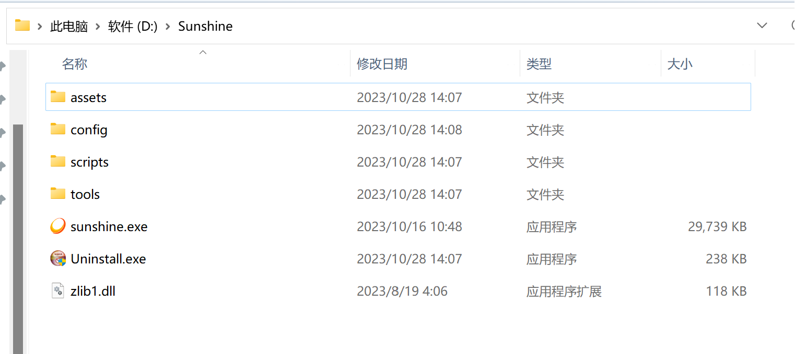
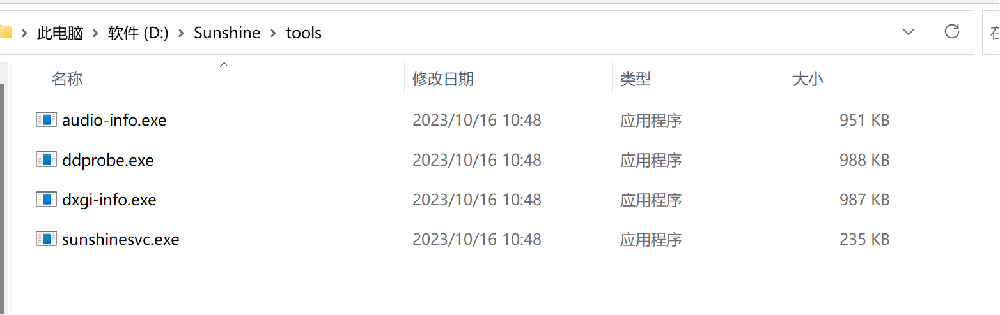
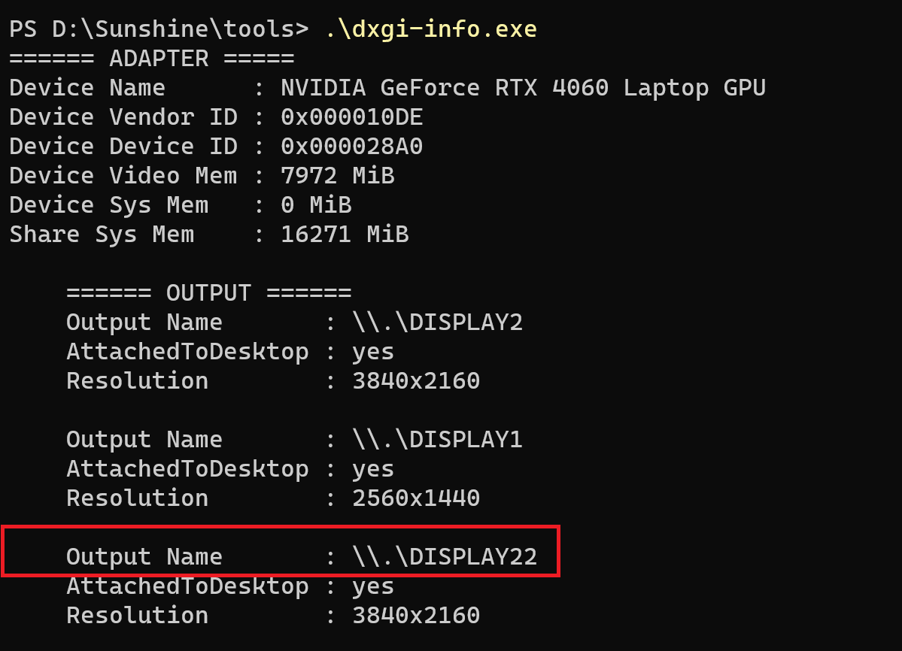
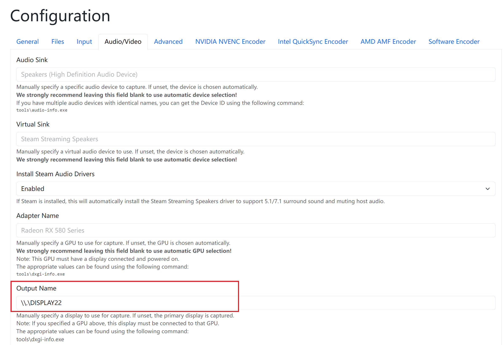

# 平板做电脑副屏
> 2023.11.11

**本文档记录了将平板（或手机）设置为电脑副屏的方法，同时电脑音频也可以从平板输出。此方法需要电脑和平板处于同一局域网下（校园网不是同一局域网），且只要网络流畅，音视频输出延迟很低。**

## 需要安装的软件
1. 平板上安装`moonlight(安卓版)`
2. 电脑上安装`sunshine`
3. 电脑上下载虚拟显示器软件，下载及使用方法见文章[WIN版虚拟显示器](https://www.cnblogs.com/zspace/p/17069763.html)  
    1. 创建虚拟桌面命令`./deviceinstaller64 enableidd 1` 该命令运行一次创建一个虚拟桌面
    2. 去除虚拟桌面命令`./deviceinstaller64 enableidd 0` 该命令运行一次删除一个虚拟桌面
4. 查看虚拟桌面编号方法
    1. 使用everything搜索sunshine的下载目录
    2. 进入tools目录下
    3. 命令行运行命令`./dxgi-info.exe` 运行该程序即可查看目前电脑所有桌面各自对应的编号 
    
5. 设置平板显示电脑的哪一个桌面  
    进入sunshine的配置界面，将上一步中获取到的虚拟桌面编号填入**Output Name**中，然后平板即可显示编号对应的电脑桌面

6. 在平板上启动moonlight作为电脑附屏即可。

